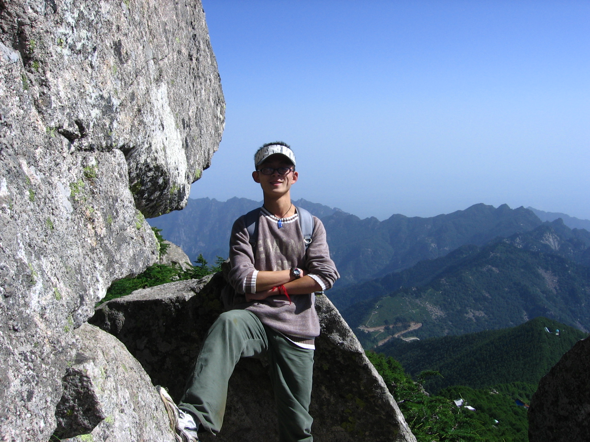
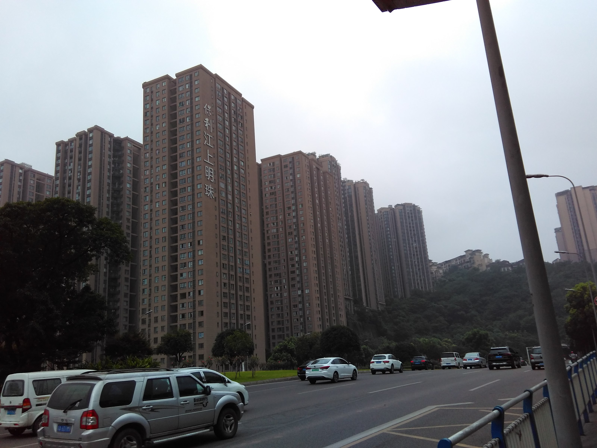

 

# Welcome to Cong Zhang's Website

Hi, it is great to meet you!  
I am currently a Master of Science candidate in Biostatistics at Columbia University Mailman School of Public Health.  
I also used to be a Professional Staff at the Institute of Social Science Survey (a.k.a. Data Center for Management Science), Peking University.

 

# My Hometown

#### Chongqing, the 3-D City of China!

I am from Chongqing, China. Chongqing is a huge municipality located in the Southwest of China, and the core city area sits at the confluence of the Long River and the Jialing River. Due to its unique terrain and weather, Chongqing is also well known among Chinese people as the "Mountain City" and the "Fog Municipality". Enjoy the view!

 

Here is my apartment, Baoli Jiangshang Mingzhu. You could clearly see how my community crawls all the way up the hills. This is very typical in Chongqing!

 

# Professional Skills {.tabset}

## Computer Skills

* Proficient in SAS Basic, SAS Macro, SQL and R;
* Fluent in Python and Stata;
* Skilled in Word, Excel, PowerPoint, Visio.

## Language Skills

* Chinese: Native Language;
* English: Test of English as a Foreign Language (TOEFL) : iBT Test Score 105;
* Spanish: Diploma of Spanish as a Foreign Language (Diploma de Español como Lengua Extranjera, DELE) : Level B1 of Common European Framework of Reference (CEFR);
* Portuguese: Elementary Diploma of Portuguese as a Foreign Language (Diploma Elementar de Português Língua Estrangeira, DEPLE): Level B1 of Common European Framework of Reference (CEFR);
* Italian: Certification of Italian as a Foreign Language (Certificazione di Italiano come Lingua Straniera, CILS): Level B1 of Common European Framework of Reference (CEFR).

 

# Data Science {.tabset}

## My Projects

I am currently working on a project of professional wine reviews with my teammates. This project would be posted here once it is done. Please wait for a moment.

## Useful Resources

Here are some useful resources for data science:

* [Google](https://www.google.com)
* [P8105](https://p8105.com)
* [R for Data Science](https://r4ds.had.co.nz/index.html)
* [R Programming for Data Science](https://bookdown.org/rdpeng/rprogdatascience/)
* [Introduction to R for Public Health Researchers](http://aejaffe.com/summerR_2016/)

 

# Academic & Work Experiences

If you are interested in my academic and work experience, please refer to my [Resume](resume.html) for detailed information.

